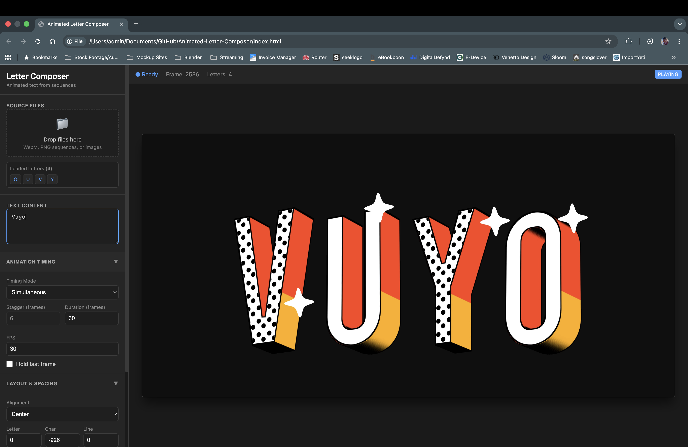

## How to Use

1. Open `index.html` in Chrome or Edge
2. Upload animated letter files:
   - PNG sequences (A_001.png, A_002.png…)
   - or videos with alpha (WebM, ProRes)
3. Type text using available letters
4. Click Play to preview
5. Export PNG, WebM, or ProRes for further use

# AniType
AniType is a focused kinetic typography tool for generating animated letter compositions with transparency. Built for motion designers, VJs, and creative technologists, it enables custom animated alphabets to be composed into words and phrases, then exported with alpha for professional pipelines.

AniType is not a video editor. It is a type engine.

# Why AniType Exists

Most motion tools are timeline-driven editors. AniType takes a different approach.

AniType treats typography as a system of animated components rather than clips on a timeline. Each letter is an independent animated asset, allowing type to be assembled procedurally, rendered deterministically, and reused across live and real-time environments.

The tool is designed for workflows where speed, consistency, and alpha preservation matter more than keyframes and audio.

# Core Concepts
Animated Letter Library

Each character is loaded as either:

A video file with alpha (WebM, ProRes, MKV)

A PNG image sequence (RGBA)

Letters are indexed by character and stored in a reusable library. When text is entered, AniType renders only the letters that exist, enabling incomplete or stylized alphabets.

# Alpha-First Rendering

AniType renders exclusively to an alpha-enabled canvas. No background is baked into previews or exports. Transparency is preserved from source assets through final output.

# Frame-Driven Playback

Playback is frame-based rather than timeline-based. Frame rate defines animation timing, making outputs predictable, loop-safe, and ideal for batch rendering.

# Features

# Letter Composition

Custom animated alphabets

Adjustable letter spacing

Multi-character text composition

Vertical centering per line

# Preview Engine

Real-time canvas preview

Mixed media support (video and PNG sequences)

Frame-accurate playback

# Export Formats

PNG image sequences (RGBA)

WebM (VP9 with alpha)

ProRes 4444 (desktop workflow)

DXV3 with alpha via Resolume Alley

# Batch Rendering

Fixed-duration renders

Deterministic frame output

Designed for automation and scaling

# DXV and Resolume Workflow

DXV is a proprietary codec and cannot be encoded directly in-browser.

AniType follows the official, production-safe workflow:

Render PNG sequence or ProRes 4444 with alpha

Convert to DXV3 using Resolume Alley

Import directly into Resolume Arena or Avenue

This ensures GPU-optimized playback and full compatibility with Resolume’s ecosystem.

# What AniType Is Not

Not a non-linear video editor

Not an audio-based tool

Not a timeline compositor

Not intended for narrative editing

Audio is intentionally not a priority. AniType is a typography generation tool, not an editing suite.

# Intended Use Cases

Kinetic typography loops

VJ and live performance visuals

LED wall content

Motion branding assets

Generative typography systems

Real-time visual pipelines

# Tech Stack

HTML5 Canvas

JavaScript (framework-agnostic)

Tailwind CSS

FFmpeg (desktop rendering)

Resolume Alley (DXV encoding)

Electron (desktop distribution)

# Project Status

AniType is under active development. Current focus areas include export reliability, batch workflows, and integration with live visual systems rather than UI experimentation.
